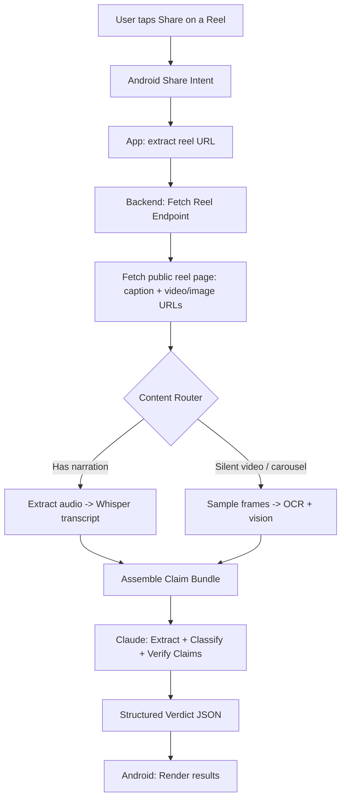

# Reel Fact-Checker — System Design Guide

A reference architecture for a "share-to-fact-check" Android app: a user shares an Instagram reel to the app, and it returns a claim-by-claim fact check with sourced verdicts.

This document is written to double as a teaching artifact for system design — every major decision includes the alternatives considered and why they were rejected, not just the final choice.

---

## 1. Problem Statement & Constraints

**Goal:** Given a reel a user is already viewing, extract its factual claims and verify them against reliable sources, fast enough to feel usable, cheaply enough to run for free at low volume, and structured to scale later without a rewrite.

**Hard constraint — platform compliance.** Instagram's Terms of Service prohibit scraping and unauthorized automated access, and Instagram actively detects and blocks it. Apple has removed apps from the App Store for accessing Instagram's service without authorization. This rules out any design that scrapes feeds in the background or overlays live on top of the Instagram app. The **share sheet** is the compliant boundary: the user takes an explicit action, on content they're already viewing, to hand a single URL to a third-party app — the same mechanism Instagram itself exposes for "share to..." with any app. We fetch only what's publicly visible on that one shared reel, once, on explicit user request. This is the load-bearing decision in the whole system — it's what keeps the product legal and the accounts of the people using it safe.

**Non-goals (for v1):**
- No background monitoring of a user's feed
- No bulk/scheduled scraping
- No user account system or history (stateless by design, see §5)
- No iOS support yet (Android's share intents and fewer platform restrictions make it the faster path to a working system)

---

## 2. High-Level Architecture



**Why this shape:** the Content Router is the key architectural fork. Routing on *media type* (narrated video vs. silent/carousel) instead of always running both pipelines saves cost and latency — most reels don't need OCR, most carousels don't need transcription. It's a cheap classification step (a few hundred ms of audio-energy checking) that avoids paying for two expensive paths on every request.

---

## 3. Component Breakdown

### 3.1 Android Share Module
- `ACTION_SEND` intent filter registered for `text/plain` (Instagram shares the reel URL as text in the vast majority of cases).
- Extracts and validates the URL, shows a loading state, calls the backend, renders the result.
- Deliberately thin: no business logic on-device. This keeps the client swappable (iOS later reuses the same backend) and keeps API keys server-side only.

### 3.2 Fetch Reel Service
- Given a public reel URL, resolves caption text, media URLs (video or carousel images), and any metadata (author, timestamp).
- This is a single on-demand fetch triggered by explicit user action — not a crawl, not scheduled, not bulk. That distinction matters for §1's compliance boundary.

### 3.3 Content Router
- Lightweight heuristic, not a Claude call: run a quick voice-activity/energy check on the extracted audio track.
  - Signal detected → narration path.
  - Silence or no audio track → visual path.
- Rationale for a heuristic over an ML classifier: this is a binary, cheap-to-compute signal. Spending a Claude call just to decide "should I call Claude" is wasted latency and cost.

### 3.4 Transcription (narration path)
- `faster-whisper` running self-hosted on the backend instance, not a paid transcription API.
- Trade-off: self-hosting costs cold-start latency and CPU; a paid API (e.g. hosted Whisper) would be faster and simpler but breaks the "free to run" constraint at any real volume. Revisit this trade when usage numbers justify the spend (see §6).

### 3.5 Frame Extraction & OCR (visual path)
- Carousels: each image is already a discrete "frame" — no sampling needed.
- Silent videos: frame-difference heuristic (compare consecutive frames, keep ones with significant pixel change) to grab scene changes rather than fixed-interval sampling. This avoids both redundant near-duplicate frames and missing a fast on-screen text change between fixed sample points.
- OCR/reading happens inside the Claude call itself (send frames as images, ask it to read on-screen text) rather than a separate OCR engine — one fewer moving part, and Claude's vision handles stylized text/overlays better than traditional OCR.

### 3.6 Claim Bundle Assembly
- A single structured payload: `{caption, transcript?, frames?, source_url}` — whichever fields are populated by the router.
- This is the seam between "getting the content" and "understanding the content." Keeping it as one clean handoff object means the extraction side and the reasoning side can be developed, tested, and scaled independently.

### 3.7 Fact-Check Reasoning (Claude)
- Two-stage prompt structure, not one call doing everything:
  1. **Extraction + classification** — pull discrete claims from the bundle, tag each as `factual | speculative | opinion`.
  2. **Verification** — for `factual` claims only, use web search to check them, and score source reliability.
- Splitting these matters: it's cheaper to skip verification (and its search calls) for claims that are opinion/speculation, and it makes the reasoning auditable — you can log what was classified before verification ran and catch classification drift independently of verification quality.
- Output is structured JSON (see §4), never free text — this is what makes the "quick answer then breakdown" UI possible without a second parsing step.

---

## 4. Response Schema

```json
{
  "headline_verdict": "Contains one false claim and one unverifiable claim",
  "claims": [
    {
      "claim": "text of the claim as stated in the reel",
      "classification": "factual | speculative | opinion",
      "verdict": "verified | false | unverified | not_applicable",
      "explanation": "short reasoning",
      "sources": [
        {"url": "...", "reliability": "high | medium | low | questionable", "note": "why this reliability tier"}
      ]
    }
  ]
}
```

**Design note on reliability flagging:** the schema forces a reliability tier on every source, not just a link. This was a deliberate response to the requirement that questionable sources be flagged rather than silently used — if a low-reliability source is the *only* one available for a claim, the verdict should read as "unverified, best available source is questionable," never as a clean "verified."

---

## 5. Data & State

**Decision: stateless, no database in v1.** Each request is fetch → process → return → discard. No user accounts, no stored history.

**Why not persist from day one:**
- Removes an entire compliance question (retention of scraped-adjacent content, even user-triggered) until it's actually needed.
- Removes a whole category of infra (DB provisioning, migrations, backups) from the free-tier footprint.
- The stateless boundary is also what makes horizontal scaling trivial later (§6) — no session affinity, no shared state to coordinate.

**When to add persistence:** once you want caching (same reel checked twice shouldn't redo the pipeline) or user history. At that point, a cache keyed on reel URL (with a short TTL, since claims and context can change) is the first thing to add — not user accounts.

---

## 6. Infrastructure & Scaling Path

| Stage | Compute | Rationale |
|---|---|---|
| **v1 (now)** | Cloud Run / Fly.io, scale-to-zero | Free at low/no traffic since billing is per-request-second, not per-hour. No cost while idle. |
| **Growth** | Same platform, min-instances=1 | Once cold starts (Whisper model load, container spin-up) hurt UX enough to matter, pay for one warm instance instead of scaling infra type. |
| **Scale** | Add a cache layer (Redis/Supabase) keyed on reel URL | Avoids reprocessing viral reels hundreds of times; biggest cost lever available before touching compute. |
| **Scale+** | Queue-based processing (Cloud Tasks) instead of synchronous request/response | Only needed once video processing time regularly exceeds acceptable request latency (e.g. long reels, backend under load). Client polls or gets a push notification on completion. |

**The single biggest cost lever isn't infrastructure — it's the Claude API usage**, since that's the only per-request cost that scales linearly with real usage rather than being absorbable by scale-to-zero compute. The cache layer above exists primarily to avoid re-paying for identical reasoning on the same reel.

**Explicitly deferred until justified by real numbers:** managed transcription API, dedicated GPU inference, multi-region deployment. Each adds cost or complexity that only pays for itself past a usage threshold this project hasn't hit yet — naming them here so the deferral is a decision, not an oversight.

---

## 7. Failure Modes & Edge Cases

- **Reel is private / deleted by the time it's fetched** → fail gracefully with a clear "couldn't access this reel" message, not a silent empty result.
- **No claims extracted** (pure entertainment content) → return a "no factual claims detected" headline rather than forcing a verdict.
- **Verification search finds no source at all** → verdict is `unverified`, explicitly distinct from `false`. Absence of evidence is not evidence of falsehood.
- **Whisper transcription garbage on noisy audio** → low-confidence transcript should lower confidence on any claim derived from it, surfaced in the explanation field, not hidden.
- **Claude reasoning failure / malformed JSON** → backend should retry once with a stricter format reminder before surfacing an error to the user, rather than showing broken output.

---

## 8. Security & Privacy

- No API keys on-device — all Claude/backend calls happen server-side, client only ever talks to your own backend.
- No stored user data by default (§5) — nothing to secure that doesn't exist.
- Reel content is processed transiently and discarded post-response in v1; if caching is added later, cache only the *derived* fact-check result, not raw video/audio, to minimize what's retained.

---

## 9. What Makes This "Exemplary" (Summary of Principles)

1. **The compliance boundary drove the architecture**, not the other way around — the share-sheet decision in §1 shaped every downstream choice.
2. **Every "expensive" step is gated by a cheap decision first** (content router before transcription/OCR, classification before verification) — don't pay for reasoning you can avoid with a cheap heuristic.
3. **Stateless until state is earned** — persistence adds cost and risk; add it when a concrete need (caching, history) justifies it, not preemptively.
4. **Structured output over free text** wherever a UI or downstream logic depends on the result — makes the system auditable and testable.
5. **Deferred decisions are named, not hidden** — §6 lists what wasn't built and why, so scaling is a roadmap, not a rewrite.

---

*Next: Android share-intent module and backend pipeline scaffolding, built to match the components above.*
